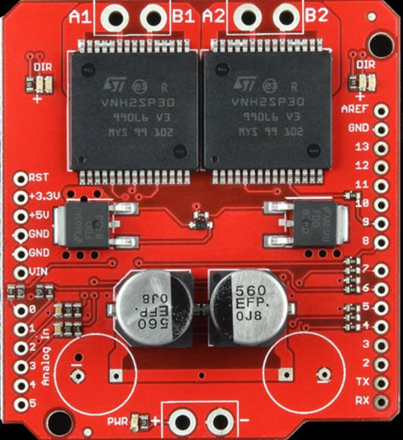
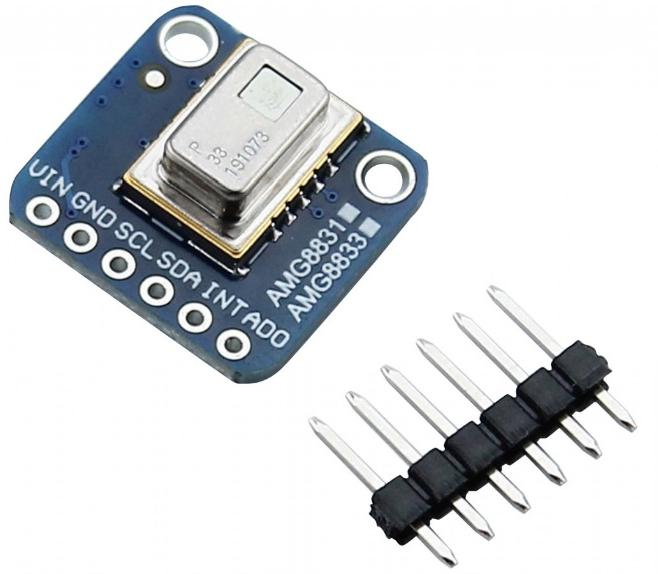

# Rapidly Manufactured Robot Challenge

# Robocup Rescue 2022

Arthur Martins de Souza Barreto, Enricco Gemha

Felipe Catapano Emrich Melo, Rafael Eli Katri.

April 2022

# Gratitude

Before everything, we want to express our gratitude for some people and organization, without their help we could not achieve everything we already did and still going. In special, Carlos, Felipe Catapano&#39;s father, where he had the initial insight and gave his house for our fist meetings.

We also would like to a huge thank you for our intuition, Insper, they helped us a lot when we need to find a place to train, have our meetings and principally, helped us to pay the cost from our travel to Robocup.

The following names helped us, directly or indirectly, to be the robotics team and build our robot. Thank you, Miranda, Raul, Alicia, Nilson, all laboratorian technical and our family for giving us support.

# About us


We are a Brazilian team, from São Paulo, São Paulo. We born last year, with 3 students from Computer Engineer, two of them already had participate from Robocup, 4 and 2 times respectively, the other is a visionary.

After some hard work we became an official robotics team from our College, Insper, and today we are Insper Dynamics. Our group have students from different courses, Administration, Mechatronics Engineer, Mechanic Engineer, and Computer Engineer. Today we are 15, and still growing up.

## Our Social Medias

- Linkedin:

[https://www.linkedin.com/company/insperdynamics/mycompany/?viewAsMember=true](https://www.linkedin.com/company/insperdynamics/mycompany/?viewAsMember=true)

- Instagram:

[https://www.instagram.com/insper\_dynamics/](https://www.instagram.com/insper_dynamics/)

- Email:

[insperdynamics@gmail.com](mailto:insperdynamics@gmail.com)

- Github:

[https://github.com/InsperDynamics](https://github.com/InsperDynamics)

# Abstract

Our objective is to build a robot capable to get in dangerous ambientes, after natural disasters, places where the human would not be able to go, like a building after an earthquake.

The robot also be able to identify some images to take some actions, if he identifies a symbol of a specific warning, be able to handle it and take the correct action.

The robot is semi-autonomous, at a fist moment he going to be controlled by a remote control, being guide by the image from his camera, and at the same time, he will be mapping the ambient with a laser scanner. With the time pass, he will be able to be autonomous and take his own decision without the human interference.

Also, all the robots were imagined to be fast reproduced, his parts were designed and printed or manufactured, always thinking in how fast we can do it and the better way we can do it.

# Introduction

The world is changing fast, and day after day better solutions comes up. Ten years ago, we had an idea from autonomous cars, self-driving. However, nowadays, we got some cars capable to do that, man is always improving something.

With it in mind, Robocup was born to incentive students under the study from robotics and technology, AI development, everything that would be able to help humankind.

The Rapidly Manufactured Robot Challenge is a category from Robocup, with the goal to build a fast robot make and at the same time, a robot capable to help ser human, going into dangerous places where the man would suffer life risk.

This challenge takes us, Insper Dynamics team to think a lot about some strategies and the results is everything under this paper. For this competition, our team have four members, Arthur, Felipe, Antônio and Rafael, all from 3rd semester at Computer Engineer. The first two students acted as team leaders, teaching everything the group needed, both have 6 participations at Robocup if we some of them. Due we be a new team, we had no teacher helping us yet, but we got great results and have a big expectation on competition.

# Robot

Our robot has all the parts made by us, the body, the arm, the wells, the PCB. The next lines are going to clarify how we imagine and made every part.


## Structure

The robot was designed to have two main bodies, independent one from another.


The front and back parts are free to twist around the axis of a central bearing, up to 30 degrees to each side (limited by a cental locking piece). This was done to allow the robot to always have all wheels in contact with the ground. When the robot finds an obstacle that makes a wheel lift, the robot twists, adjusting for the format of the field and continuing its task.


On its chassis, we got those two parts, and inside them we placed the following components inside:

- Lipo Battery
- Arduino Mega
- Jetson Nano
- Motor Driver
- Power Bank
- Our PCB

We got two different power sources, one destined for actuators and the other for boards and sensors. This way we avoid interference from low battery under both parts.


On the body, we have four supports, two at each part. Those supports are going to receive the motors, and after that connect into the wheel.


Furthermore, the robot has an arm, present on the top of the robot. All its parts were 3D-printed and can be downloaded from our repository in GitHub. Chassis STL files and a full model of the robot are also present in the same repository.

The wheels were CNC machined, using equipment from our university. Also, the project can be download at our GitHub page and is free for studying.

The parts discussed above are going to be more clarified on future topics.

### Printing Parts

As one of the main objectives of the RoboCup Rescue RMRC is to develop research across rescue applications, there is a need to create a robot that can be widely spread over different kinds of situations.

Expanding this need, a list of restrictions was created to help our team choose the best material and construction method:

- High impact resistance
- Little flexibility
- Rapid manufacture
- High temperature and fire resistance.

After considering the restrictions made, it was chosen three types of material and 3D printing methods for three stages of development.

The first stage is responsible for the creation of the robot, in which it is made multiple calls between team members to choose which type of robot is better and build different kinds of chassis. In this stage it was used ABS plastic to print beta prototypes of the chassis - In this stage, it was clear that ABS could not be used in the final product as it presented a high flow limit and large deformation in its plastic region.

The second stage was responsible for the development of the chosen chassis and printing of prototypes that simulate the final product (in terms of faithfulness and precision). In this stage, it was used PLA plastic to print the following parts:

- Chassis
- Wheel rim and frame
- Central Bearing Shaft
- Hook

The parts printed presented minimum deformation in its plastic chemical region, good weight resistance but awful resistance to high temperature.

The third stage was responsible for the finalization of development, and production of a function prototype, which used ASA WP filament, provided by 3D Fila (a Brazilian 3D filament company). In this step it was printed the following parts:

- Final Chassis
- Lidar Support
- Camera Support
- Central Bearing Shaft and Limiter
- Hook
- Central support for all the components.

This filament presented good resistance to Wight and deformation - having also the capability of resisting a hostile environment with high UV light and high-temperature exposure.

### Wheels

The robot can move using 4 special wheels designed by the team, arranged in a differential drive setup.

By creating very large (both in width and diameter) profiles with five pickaxe-like surfaces, it was possible to create a drive system that can maneuver on a large variety of terrains and maintain firm contact with the ground. The wheels can naturally &quot;grab&quot; obstacles such as steps and pipes to overcome them, as well as burrow under rocks and sand for better grip.

Unlike threaded designs, this makes them easier to control, as the wheels discard the necessity of arms with additional motors and allow the bearing suspension to be implemented. This way, the robot can always keep four points of contact with the terrain in a passively, self-adapted fashion.

After experimenting with a prototype made with resin and low-infill 3D printing, the team decided to invest on a definitive model for the wheels, based on aluminum and rubber. A CNC machine toolpath with multiple tools was created to replicate more durable and lightweight wheels easily, and support surrounding rubber tires with much higher across all common surfaces.


### Arm

The arm is used to manipulate objects during mobile operation. It has to be able to rotate, extract, precisely touch and allow inspection of relevant features in the environment, that can be positioned in a variety of ways. Therefore, a movable arm was designed from the ground-up to attend those tasks.

Driven by four MG996R and two MG90S servo motors, the arm does not increase the size of the robot (height excluded) when retracted and can reach forward up to two times the chassis length when fully extended. Furthermore, the position of all joints can be controlled independently and precisely.

The end claw has a large, wavy area of contact that can easily attach to objects such as pipe caps. Thanks to two small arc-shaped pieces attached to each finger, it can open and close in a translation-only direction of movement, instead of rotating like human fingers. This is advantageous because the claw can always keep a larger area of contact with the object and evenly distribute the imposing weight.

## Electronics

For the electronics, we started the project with the goal to build our own PCB, and with it, avoid some problems of using cables, bad contacts and all the things that made you crazy at the competition due using cables.

### Motor Drivers

Everyone when get in the robot&#39;s world use the h-bride L298n, super simple to program. However, this h-bride is not efficient energetically, it doesn&#39;t use CMOS technology, and due that have a considerable loss of energy.

To solution this problem we are using another h-bride, a super version from L298n, but using CMOS technology, the VNH2SP30 Dual Driver. This driver can control 2 motors DC, with 30A of current.

We decided to use 4 motors, one at each wheel, so we are using 2 h-bridges to control all of them.



Our version is a shield to Arduino uno&#39;s, as the image above. This motor drive uses the following ports to control the motors:

- Digital 4: InputB from motor 1
- Digital 5: PWM from motor 1
- Digital 6: PWM from motor 2
- Digital 7: InputA from motor 1
- Digital 8: InputA from motor 2
- Digital 9: InputB from motor 2
- Analogic 0: Enable from motor 1
- Analogic 1: Enable from motor 2

The logic from VNH2SP30 is the same as L298n, the only difference is the enable pins, with need to be HIGH to work.

### Voltage Regulator

Our arm works with servo motors, and they are 6 volts. We would need another battery to make the arm work, instead of that we are using a voltage regulator. When we read it under internet, we imagine a 7806 (a simple voltage regulator to 6V).

But previously, we talked about energy efficiency, we this CI is not so efficient, actually, depended on the current, we can have a efficient less 50 %, that would imply a lower life from battery.

To avoid it, we choose the following component, the LM2576.


This component is a regulated voltage tensor, with a higher efficiency. We used the circuit indicated from the fabricant, at DATASHEET.


View the datasheet at: [https://datasheetspdf.com/pdffile/61720/NationalSemiconductor/LM2576/1](https://datasheetspdf.com/pdffile/61720/NationalSemiconductor/LM2576/1)

###

### PCB

To combine everything and make it simpler to use we projected the PCB to receive the Arduino mega, the voltage regulator circuit, the inputs from the servos, the inputs from CO2 sensor and the thermal camera input.

For project it, we used the software Proteus, with our college gave us the license. Our schematic follows bellow:

In the schematic we can verify 5 regions, two represent the h-bridges, one represents servos inputs and the battery input, the other the Arduino mega input with the sensor and thermal camera and the last, the voltage regulated circuit.

On our first version we had space problems, so we decided to take out the inputs that we were not using from Arduino mega. This way, we got more space to make the lines on board. Also, on the first version, we had a problem with the space to put the inductor and the capacitor from . For simplify it, we put a T-block connection and the problem to put the component was solved. So, we had the following result to the board:


To attach on the robot, we put two holes to attach using screw. The board is 2 faced, in another word, it conducts in both sides, the red part conduct at the top, and the blue part conduct at the bottom.

All the inputs from PCB have cables, specially done, for make this connection. On the photos we can see red and black cables. On the board are the cables that support the power of the h-bridges. The other one was to test the boar but are going to receive the battery supply. All the files to make the board can be find at the team github, also you can check pdf from the schematic, bottom, and upper face from the board.

We haven&#39;t mentioned the Jetson Nano yet, but it is used to supply the Arduino, using the serial port. This way, the Arduino is supporting the power for the thermal camera and the CO2 sensor. Besides that, the power bank is responsible to supply the Jetson Nano, this way, we have the control and power parts with different sources.

## Communication

The robot uses two forms for communication, one is for be the bridge between the notebook and the jetson nano, and the last one is used intergrade all the sensor, Arduino with the Jetson Nano.

### VNC

VNC (Virtual Network Computing) is an internet protocol that allows viewing of remote graphical interfaces over a secure connection. In another words, we are going to access Jetson Nano using it, with an ethernet cable.

Download at: [https://www.realvnc.com/pt/connect/download/viewer/](https://www.realvnc.com/pt/connect/download/viewer/)

For this communication, we are using a switch, as the image.


The switch can send and receive data if we use the cable directly on Jetson it would not be possible. At this point, we can access all graphic interface from Jetson only using this switch and an ethernet cable, ready to start the set up and configurations.

### ROS


ROS (Robot Operating System) is a tool to make easier and simple the communication between the robot and all the peripherals. Each peripheral can be imagined as a node, and this node something only read, sometimes only write, or can do both. The node can be a sensor, a motor, an Arduino, anything you need, and it is open source. Now more at: [https://www.ros.org](https://www.ros.org/) .

For our robot we are using ROS to make Arduino and jetson communication, everything that is connected on Arduino are receiving order from Jetson and completing their tasks using ROS. Jetson is our central part of communication and responsible from all the actions, read sensor, turn on the motors, everything using ROS. The next lines will clarify how we did it and give you move details how do the same.

## Software Overview

Running software on the robot is divided in 3 parts that operate asynchronously. C++ is utilized for the main code, which is responsible for user interfacing and machine vision algorithms, utilizing OpenCV, as well as communicating with the Arduino via ROS-Serial.

The Arduino board´s code is responsible for low-level interfacing of motors, thermal sensor, and gas sensor with PWM and I2C communication protocols. This is uploaded to the board via the Arduino IDE installed on the main board. Lastly, a set of Python scripts is used to launch base ROS nodes and handling input from the Lidar and Realsense sensors. These are manifested by the laser\_scan and odometry-related topics respectively.

The team used Visual Studio Community, Visual Studio Code and Sublime Text 3 during the developed of all self-made scripts used by the robot.

### Setup

To evaluate and run the software, a few dependencies have to be present on the target environment. The team recommends the utilization of Ubuntu 18.04LTS as the operating system for all steps.

Firstly, the user is required to install ROS on their machine. More instructions on this task can be found at [http://wiki.ros.org/ROS/Installation](http://wiki.ros.org/ROS/Installation) (for Ubuntu 18.04, the Melodic Morenia distribution is recommended). This is the middleware required for all virtual nodes to communicate.

Additionally, OpenCV, ZBar and SDL are required for the main portion of the software to execute correctly.

Arduino IDE should be installed to manage and upload code to the Arduino Mega. Instructions to do this on Linux machines can be found at [https://docs.arduino.cc/software/ide-v1/tutorials/Linux](https://docs.arduino.cc/software/ide-v1/tutorials/Linux). Lastly for dependencies, the user can install SoX to transmit input from the robot´s microphone to the operator in real time.

To run the team´s code, use git to clone the repository at [https://github.com/InsperDynamics/REDOX-RoboCup-RMRC-Challenge](https://github.com/InsperDynamics/REDOX-RoboCup-RMRC-Challenge).

The Arduino\_Side folder contains software to be uploaded via ArduinoIDE, all necessary external libraries can be installed via library manager. They are: rosserial (version 0.7.9), Adafruit_AMG88xx (any version) and Adafruit_CCS811 (any version).
The main C++ software is found at Machine Vision and should be compiled via g++. Use catkin\_make command to build necessary ROS packages prior to launching the interface.

 A bash file is included in order to automatically install all of the necessary dependencies on a Jetson Nano device with a fresh installation of the official JetPack OS.

To access the robot via VNC, the team recommends the usage of VNC Viewer. The instructions on this page can be used to find the IP address of the main board: [https://help.ubuntu.com/stable/ubuntu-help/net-findip.html.en](https://help.ubuntu.com/stable/ubuntu-help/net-findip.html.en). In case of difficulties while trying to forward input from the gamepad to the VNC server, the user can use USB/IP (install and setup instructions at [http://usbip.sourceforge.net/](http://usbip.sourceforge.net/) ).

### Jetson Nano

The Nvidia Jetson Nano 4gb Developer Kit was chosen to be used as the main processing unit of the robot, and is responsible for communicating with the Arduino, high-level sensors, and operator machine, as well as running the machine vision algorithms and organizing autonomous movement.

Designed for machine learning and dynamic robotics in mind, it contains a 128-core NVIDIA Maxwell™ architecture-based GPU, a Quad-core ARM CPU, 4gb of LPDDR4 RAM and has support for Linux for Tegra. All on a compact (100mm x 80mm) and affordable package. It also contains 4 USB-3 ports, gigabit ethernet, a CSI port and GPIO. This makes it very suitable for running all necessary processes required for operation in parallel, while being powered with 5V via micro-USB.


### Sensors

The competition has two specific task that need an external sensor, one is to show a thermal image from the place and the other is to show the concentration of CO2.

Their connections with the Arduino can be checked at the schematic from PCB, some explanations will be given on the next lines. Also, is important say that both only use 4 pins to work, as showed at schematic, 2 for supply and 2 for communication.

#### Thermal Camera



The thermal camera which we are using is the AMG8831, that has support for Arduino, raspberry and other with I2C communication. This electronic module has and high efficiency and is based on Infrared heat detection sensor that allows the user to detect movement in dark environments, for example.

This sensor has a matrix of 8x8 thermal sensors, and returns a matrix of 64 temperature individual reading, and has a work like a professional thermal camera.

It can identify temperature between 0ºC to 80ºC, also has and precision of . This module works with , that comes from Arduino, and is connected on SDA and SCL pins from Arduino mega. This sensor represents a node from ROS, making everything more simple and easier to organize on coding.

Know more at: [https://learn.adafruit.com/adafruit-amg8833-8x8-thermal-camera-sensor](https://learn.adafruit.com/adafruit-amg8833-8x8-thermal-camera-sensor) .

#### CO2


The CCS811 is a low power miniature digital gas sensor for monitoring air quality. A metal oxide sensor is integrated to measure the total volatile organic compounds equivalent of TVOCs, making it possible to monitor air quality when working in conjunction with microcontrollers, only requiring I2C serial communication.

The module is based on unique microplate technology, meaning the plate presents a highly reliable solution for projects that require gas sensor, fast cycle times and a significant reduction in average power consumption. The integrated MCU manages the sensor trigger modes and the measured data.

The CCS811 supports intelligent algorithms to process measurements and output an equivalent TVOC value, as well as supporting multiple measurement modes that are optimized for low power consumption, thus extending battery life in portable devices.

He also requires of power and comes from Arduino. His pins from CLOCK and DATA (SCL and SDA) are connected in series with the same pins from the thermal camera, and them connected on Arduino&#39;s I2C pins.

Learn more at: [https://www.sparkfun.com/products/14193](https://www.sparkfun.com/products/14193) .

### Lidar


Autonomous mapping is achieved using a compact rotating laser distance sensor module, mounted on top of the chassis. This is very useful not only for autonomous movement planning, but also for localizing the robot in relation to features present in the map without getting lost. The YDLidar X4 is a low-cost solution for measuring distances of 12 centimeters up to 10 meters, in two dimensions.

Lidar stands for light detection and ranging and uses pulsed laser light to measure the distance to an object. The laser is reflected off the surface of the object, and the distance to the object is determined by measuring the time it takes for the light to reach the sensor. Typically, lasers are chosen that use wavelengths of light outside the visible spectrum, usually infrared.

Power is supplied directly to the module via USB, and a second port is connected to the power bank present on the robot for the event of power supply insufficiency.

Since official drivers and ROS package support exists, interfacing with the lidar is a rather simple task. It is worth noting, however, that in the case of our robot, the module is placed upside down to avoid making the scan plane sit above the top plane of the arena walls when traversing large obstacles. Because of this, an inverted transform data is used for accurate scanning in the software.

### Realsense T265


For the front camera of the robot, an Intel Realsense T265 tracking camera was used. This module combines two OV9282 imagers with fisheye lenses, a BMI055 IMU and an Intel® Movidius™ Myriad™ 2.0 visual processing unit to deliver Visual Inertial Odometry.

Designed to work both indoors and outdoors, the camera can automatically triangulate visual features in the environment to obtain positional information that gets published to our ROS ecosystem. It helps to mitigate drift generated from Lidar-only SLAM and increase mapping confidence, even if the robot is suddenly transported from one part of the arena to another.

The wide FOV also benefits teleoperation and human control. With 163 degrees globally, the operator can have a better understanding on what is in front, above, below or on the sides the robot while moving quickly, securing pose data at the same time. By applying an anti-distortion algorithm, it also provides enough image resolution for detection of far away objects.

The only encountered downside by the team is the fact that this camera can only output images in grayscale. For color recognition, other cameras present on the robot should be used instead.

### Other Cameras

Along with the Realsense unit, the robot contains a back camera and a claw camera. Both can output colored images at 1080p resolution.


On the back, a Logitech C920 webcam is used to transmit video feed when operating in backwards motion. This is very helpful in scenarios where the robot reaches a dead-end and must return, preferably without having to turn around its own axis, something that happens constantly in RMRC. It was chosen due to its high resolution at 30 frames per second, ability to automatically adjust focus, contrast and saturation (this is achieved by RightLight 2 technology), and good FOV (78 degrees horizontally).

The C920 is also used for the audio input of the robot thanks to the two omnidirectional microphones connected to the same port of its imager.


For arm operation/inspection, an Ov5647 is attached to a support sitting above the robot´s claw. It is a small camera with 60 degrees of horizontal FOV, that takes advantage of the CSI camera port present on the left side of the Jetson Nano.

### Object Detection

Regarding object detection, the robot can detect hazmat, QR codes and motion.

To implement hazmat detection, we firstly tried to create our own model. With this objective, we gathered a dataset composed of 14 categories and started to annotate the images with Pascal-VOC to train a Yolo V4 based model. Unfortunately, we had a setback; our hardware was not good enough to train a proper model and our time was short to manually annotate the 2000+ images.

In the meantime, we found Mobile Robotics Laboratory&#39;s YOLO V3-tiny, based model, [DeepHAZMAT](https://github.com/mrl-amrl/DeepHAZMAT), as a replacement for our model. This open-source model was thoroughly crafted using real life hazmat signs, photographed form multiple angles. OpenCV, a computer vision library, reads both weight and configuration files of the model, constantly checking the input image for potential hazmat and keeping score of their confidence levels. This model&#39;s dataset is made of 13 labels, detailed hereafter:


Additionally, a non- maximum suppression algorithm filters the best candidates of the frame, as the areas surrounding hazmats tend to trigger the model with a lower score.

Motion detection is achieved via frame difference extraction. Each new obtained frame is subject to a Gaussian blur filter, a frame delta is then calculated, filtered and dilated. OpenCV´s findContours() method is then used to find all highlighted blobs in the delta frame, which get filtered by height-width ratio before being draw on screen.

The previously stated approach has proven to be very effective for detecting small, rapidly moving objects, especially high-contrast blobs, hence why we adopted it for RMRC black dot detection.

As for QR code detection, ZBar&#39;s bar code reading C++ library was used to detect QR codes on each frame. Both forms of object detection have visual representation on the interface.

### Interface

The graphical user interface utilized by the operator was entirely built in C++, utilizing OpenCV to handle all windows. It is designed for minimum complexity and ease of use since the team opted for a dual-monitor approach. Almost all controls are handled via gamepad, which is autodetected by the program, leaving only what is necessary for operation visible to the operator.

Most of the left monitor area is utilized by the current camera feed, which can be switched via the L/R buttons on the gamepad. On the upper left corner, the thermal camera feed is formed in real time, with each pixel ranging from a dark blue tone to red, according to its reading, and then upscaled. Similarly, a large yellow line is formed underneath to indicate the measured level of CO2 concentration in front of the robot.

On the right-hand side, a set of sliders is spawned for control of the arm claw. The position of each servo motor can be directly controlled with a mouse, this allows the operator to use its entire arm to precisely manipulate each joint. In contrast, moving the robot wheels is entirely based on analog joystick output, so that different velocity states can be input quickly.


The other attached monitor should be used to render Rviz or a similar visualization (e.g., Cartographer) program during operation. This is additional feedback regarding estimated states of the robot and can be useful to ensure that the robot is moving properly and mapping the environment as intended, as well as calculated trajectory, for autonomous operation. A single button on the gamepad is used to alternate between manual and autonomous control, and another for turning image post-processing on or off.

### Autonomous Part

An autonomous mode is available, which allows the robot to simultaneously map the environment, keep track of its position and control its trajectory. This is achieved using ROS&#39;s _gmapping_ and _move\_base_ packages.

Gmapping is a package that runs a simultaneous localization and mapping (SLAM) algorithm. Its only node, _slam\_gmapping_, constantly updates a map (OccupancyGrid) and the robot&#39;s position within it. The requirements of the SLAM algorithm are Lidar&#39;s laser scan input, Realsense&#39;s odometry data and the required _tf transformations_ for both sensors.

As the sensors are placed in different positions of the robot, a reference point must be defined to successfully organize its movement, which is called base link. With this matter in mind, a tf transformation is used to create an offset to the values of a sensor, associating the information to base link. The required transformations are base\_link ←Scan, which set a base\_link point based on lidar&#39;s data, odom ← base\_link, which corrects Realsense&#39;s odometry value to base link&#39;s position, and map ← odom, which associates the robot&#39;s position to a fixed reference point of the map.

While _slam\_gmapping_ is running, both map&#39;s OccupancyGrid and transformation are constantly updated. From this data a goal pose is calculated, also associated with the map&#39;s fixed reference point, and subscribed by _move\_base._ Afterward, _move\_base_ publishes to /cmd\_vel the velocity needed to assure that the robot follows the desired trajectory.

## Costs

Everything used on the robot is listed on the following table, everything is on the Brazilian coin, on the end we converted it do American Dolar for possible future comparation between the other teams.

| Component | Amount | Unitary Cost (BRL) | Total Cost (BRL) |
| --- | --- | --- | --- |
| CO2 Sensor: CCS811 | 1 | R$ 80,00 | R$ 80,00 |
| Thermal Camera: AMG8833 | 1 | R$ 240,00 | R$ 240,00 |
| VNH2SP30 Dual Driver | 2 | R$ 130,00 | R$ 260,00 |
| Arduino Mega 2560 | 1 | R$ 140,00 | R$ 140,00 |
| Servo Motor MG996R | 4 | R$ 35,00 | R$ 140,00 |
| Servo Motor MG90S | 2 | R$ 25,00 | R$ 50,00 |
| Nvidea Jetson Nano 4gb Developer Kit | 1 | R$ 1400,00 | R$ 1400,00 |
| Intel Realsense T265 | 1 | R$ 2165,00 | R$ 2165,00 |
| Ethernet Cable (15 m) | 1 | R$ 30,00 | R$ 30,00 |
| Camera Ov5647 1080p | 1 | R$ 130,00 | R$ 130,00 |
| 70:1 Metal Gearmotor 37Dx54L mm 12V (Helical Pinion) | 4 | R$ 155,00 | R$ 620,00 |
| Camera Logitech C920 | 1 | R$ 370,00 | R$ 370,00 |
| YDlidar X4 | 1 | R$ 1200,00 | R$ 1200,00 |
| PowerBank 20.000 mAh | 1 | R$ 115,00 | R$ 115,00 |
| PLA Filament (500 g) | 2 | R$ 85,00 | R$ 170,00 |
| Dualsky Eco S 12V 2200mAh LiPo battery | 1 | R$ 115,00 | R$ 115,00 |
| Dual faced Custom PCB | 1 | R$ 430,00 | R$ 430,00 |
| Bearing 6201 Ddu C3 12x32x10 | 1 | R$ 20,00 | R$ 20,00 |
| Xbox 360 Controller | 1 | R$ 60,00 | R$ 60,00 |
| TP-Link LS1005G LiteWave | 1 | R$ 105,00 | R$ 105,00 |

Total Cost is R$ 7840,00, in American dollar is $ 1.662,50. Note, the conversion between the coins were made in April, so it can change when you are reading this paper.

# Future Upgrades

Although the team was satisfied with the overall design of the robot for this edition, a few improvements could be made. These aim to obtain maximum efficiency while keeping its principles, to better attend both the general needs for real rescue scenarios, as well as more specific tasks of RoboCup Rescue.

Firstly, the project could greatly benefit from wireless connectivity. By utilizing a high-range antenna attached to the main board, the necessity of a cable manager on the operation site would be eliminated. This not only reduces human injury risks, but also removes the constraint of the ethernet cable itself, which can tangle, twist or even break depending on the environment.

High-level machine vision and ROS algorithm processing can also be shifted to the operator´s computer. This way, the robot could be redesigned to only comport sensors and lower-level components that we can design, without the need for an onboard GPU for example. The result would be a permission to reduce weight and size of the robot, as well as keeping the high-level source code on a PC for easier access and security.

The arm could also be improved with the utilization of servo units that benefit from daisy-chain technology. Models such as the DRS - 0101 HerkuleX Smart Servo can connect to one another reducing the total amount of wiring on the robot, as well as offering trapezoidal velocity profile, PID and other useful algorithms for precise control applied automatically.

Finally, the team recognizes that higher-resolution thermal imaging sensors and 3D scanning capabilities are more well-suited for real rescue scenarios. Unfortunately, no alternatives that would not significantly increase the cost of the robot were found by the team yet.

# How to setup a VNC connection 

## For reference:

* OS: Ubuntu 20.04.3 LTS
* VNC Server library: Vino (OBS: It is GNOME based)
* VNC Client: VNC viewer

## Commands that manage Vino's settings (Run once):

```
sudo apt-get install vino

gsettings set org.gnome.Vino require-encryption false

gsettings set org.gnome.Vino propmpt-enabled false

gsettings set org.gnome.Vino authentication-methods "[vnc]"

gsettings set org.gnome.Vino vnc-password $(echo -n 'insertPasswordHere'|base64)
```

## Commands to start VNC Server (Run always):

* To get the correct IP address:

```
hostname -I
```

* To start Vino:

```
/usr/lib/vino/vino-server
```
